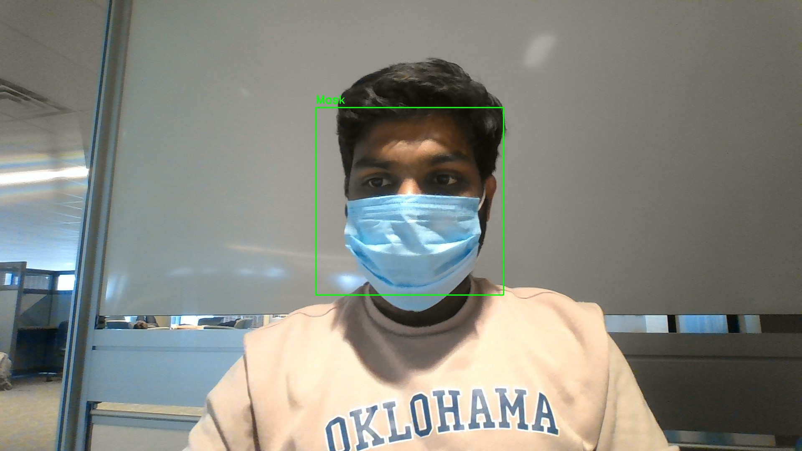
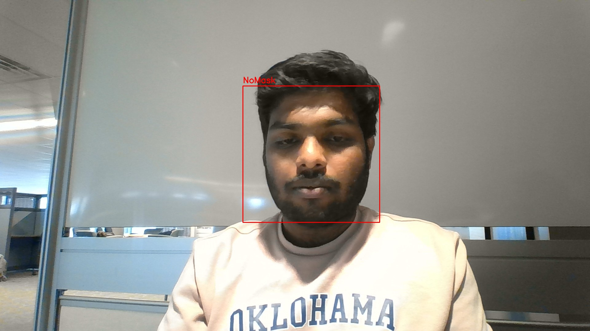

# Face-Mask Detector Project
Face-mask detection using  Convolutional Neural Network(CNN), Deep Learning , OpenCV and Haar Cascade CLassifier Model

## Project Details
To distinguish between pictures of persons wearing masks and those without, this research employs a Deep Neural Network, more precisely a Convolutional Neural Network. For the training set, the CNN achieves an accuracy of 98.2%, and on the test set, 97.3%. Next, in real time, using OpenCV, the saved weights of this CNN are used to classify as mask or no mask.

To do this task, the video frames from the webcam are preprocessed before being supplied to the model. The model operates effectively with no discernible delay between donning the mask and taking it off and displaying the forecast.

#### The model can simultaneously predict several faces with or without masks.

## Working 

### With Mask



### No Mask




## Dataset

The data used may be acquired from this repository (folders 'test' and 'train') or through this [link](https://data-flair.training/blogs/download-face-mask-data/). 1314 training photos and 194 test images in two categories—with and without masks—are included.

## How to Use

Follow these instructions to use this project on your system:

1. Type the following command into your Command Prompt to clone this repository onto your computer:

```
git clone https://github.com/njapala/FACE_MASK_DETECTION_MASTER
```
followed by:

```
cd FaceMaskDetector-MASTER
```


2. Use the following command to get all libraries:

 "pip install -r requirements.txt"

3.Type the following command into your Command Prompt to launch ImageDetection.py: 

"python ImageDetection.py" 
```
4.Type the following command into your Command Prompt to launch VideoDetection.py: 

"python VideoDetection.py"

#### The Project is now ready to use !!


